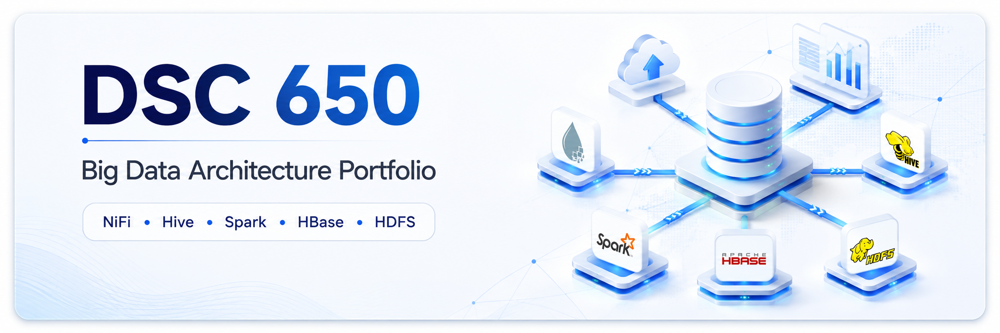
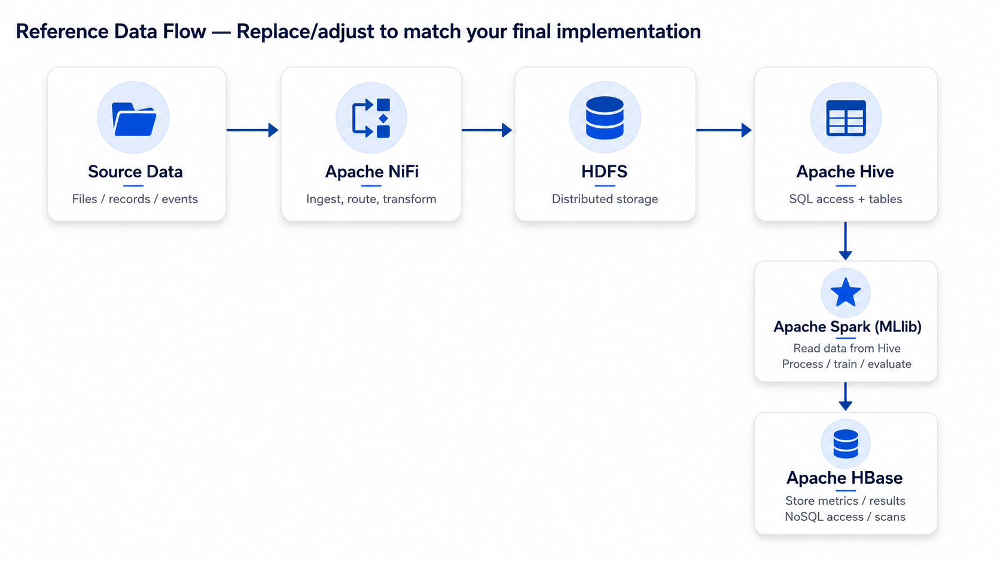
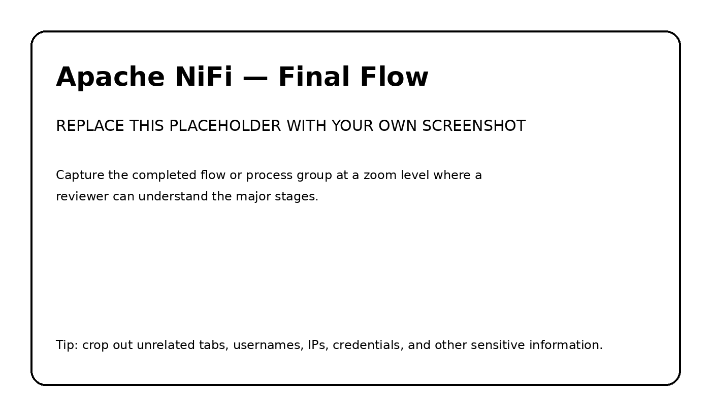
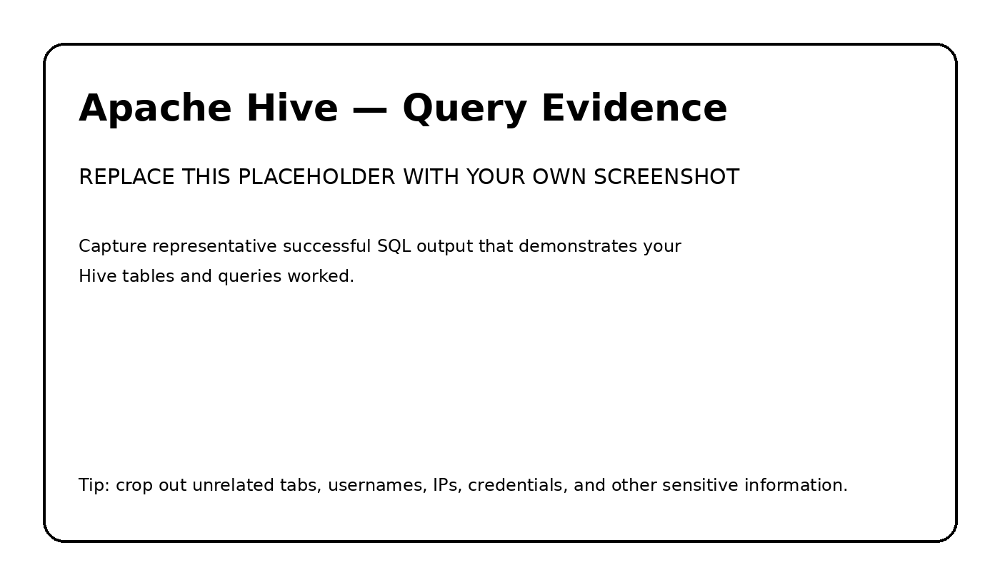
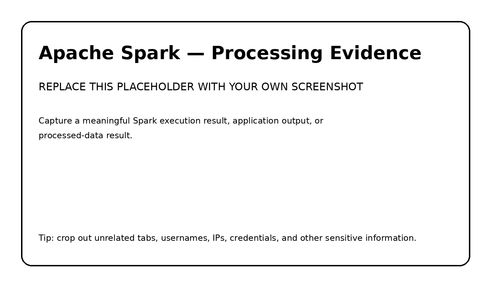
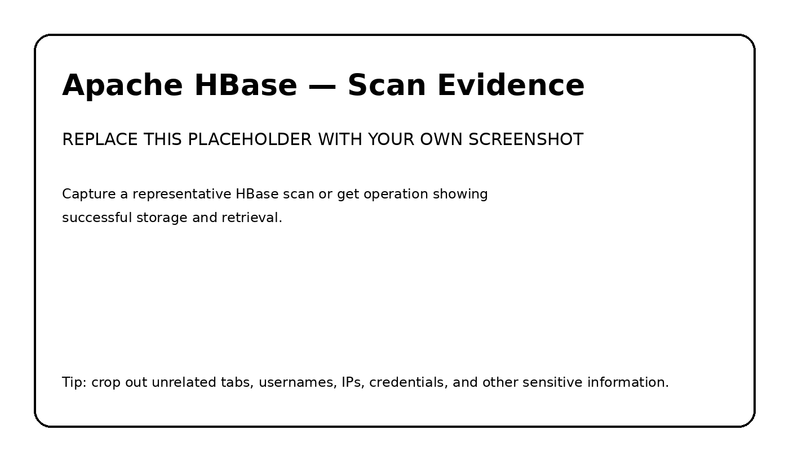

<p align="center">
  
</p>

# DSC 650 — Big Data Architecture Final Project

> **End-to-end data engineering and machine learning pipeline built across the Hadoop ecosystem.**

## Project Overview

This project delivers a complete big data pipeline that integrates **Apache NiFi, HDFS, Hive, Spark MLlib, YARN, and HBase** into a single end-to-end architecture.

The implementation demonstrates how distributed data platforms work together to move data from ingestion through storage, SQL access, machine learning, and persistent NoSQL results. The project combines data engineering, distributed processing, machine learning, and system integration into one working pipeline.

### End-to-End Data Flow

**Source Data → Apache NiFi → HDFS → Apache Hive → Apache Spark MLlib → Apache HBase**

Spark workloads are submitted through **YARN** for cluster resource management and execution.

At a high level, the pipeline performs the following:

1. **Apache NiFi** retrieves the source dataset and writes it into **HDFS**.
2. **HDFS** provides the distributed storage layer for the ingested data.
3. **Apache Hive** creates a managed table and exposes the HDFS-backed data through SQL.
4. **Apache Spark MLlib** reads the data from Hive and performs distributed machine learning.
5. Spark generates model evaluation metrics and writes those results into **Apache HBase**.
6. **HBase scans** verify that the machine learning metrics were successfully persisted.
7. **YARN** manages execution of the Spark workload across the cluster.

This repository preserves the architecture, source code, SQL, flow definitions, execution evidence, and results so the implementation can be reviewed even after the original Google Cloud environment is no longer running.

---

## Architecture

<p align="center">
  
</p>

The architecture intentionally connects multiple technologies that serve different roles within the same pipeline:

- **NiFi** handles ingestion and flow orchestration.
- **HDFS** provides distributed persistence.
- **Hive** adds a structured SQL layer over the stored dataset.
- **Spark MLlib** performs distributed processing, model training, and evaluation.
- **YARN** manages Spark execution and cluster resources.
- **HBase** stores the resulting machine learning metrics for low-latency retrieval and scan-based verification.

The result is a complete data path from raw source data to persisted analytical output.

---

## Engineering Capabilities Demonstrated

| Capability | Implementation |
|---|---|
| **Data ingestion** | Apache NiFi retrieves and routes the project dataset into HDFS |
| **Distributed storage** | HDFS provides the persistent storage layer for downstream processing |
| **SQL data access** | Apache Hive creates a managed table and supports validation and aggregation queries |
| **Distributed processing** | Apache Spark processes the Hive-backed dataset across the cluster |
| **Machine learning** | Spark MLlib trains and evaluates a machine learning model on the project dataset |
| **Resource management** | YARN schedules and manages the Spark workload |
| **NoSQL persistence** | Apache HBase stores model metrics generated by Spark |
| **End-to-end verification** | HDFS listings, Hive queries, Spark output, and HBase scans prove each stage executed successfully |
| **Cloud deployment** | The multi-service environment is operated on Google Cloud infrastructure |

---

## Repository Structure

```text
DSC650_GitHub_Portfolio_Starter/
│
├── README.md
├── STUDENT-CHECKLIST.md
├── PORTFOLIO-GUIDE.md
├── .gitignore
│
├── assets/
│   └── portfolio-banner.png
│
├── architecture/
│   ├── architecture-diagram.png
│   └── README.md
│
├── nifi/
│   ├── README.md
│   ├── flow-definition.json
│   └── screenshots/
│       └── nifi-flow.png
│
├── hive/
│   ├── README.md
│   ├── create_tables.sql
│   ├── queries.sql
│   └── screenshots/
│       └── hive-query-results.png
│
├── spark/
│   ├── README.md
│   ├── processing.py
│   ├── analysis.py
│   └── screenshots/
│       └── spark-job-results.png
│
├── hbase/
│   ├── README.md
│   ├── commands.txt
│   └── screenshots/
│       └── hbase-scan-results.png
│
├── sample-data/
│   └── README.md
│
└── docs/
    ├── project-summary.md
    └── interview-talking-points.md
```

The repository is organized by **technology and engineering function**, making it easy to follow the implementation from ingestion through machine learning and final persistence.

---

## Apache NiFi — Data Ingestion and Orchestration

<p align="center">
  
</p>

Apache NiFi provides the ingestion and orchestration layer for the pipeline. The flow retrieves the project dataset from its source, routes the data through the required processors, and writes the resulting data into HDFS.

This stage demonstrates:

- automated data acquisition;
- processor-based flow design;
- routing and transformation;
- movement of data into distributed storage;
- operational verification through NiFi queues and processor status.

The completed flow provides the entry point for the entire downstream pipeline.

**Implementation files:** [`nifi/`](nifi/)

---

## HDFS — Distributed Storage

HDFS serves as the persistent distributed storage layer between ingestion and analytics.

After NiFi completes the ingestion process, command-line verification confirms that the dataset is present in HDFS and available to downstream services. This separates data movement from processing and provides a durable storage layer that Hive and Spark can use.

This stage demonstrates:

- distributed file storage;
- integration between NiFi and Hadoop;
- command-line validation of ingested data;
- separation of ingestion, storage, and compute responsibilities.

---

## Apache Hive — SQL Data Access

<p align="center">
  
</p>

Apache Hive provides the structured SQL layer for the pipeline. A managed Hive table is created from the data ingested into HDFS, allowing the dataset to be queried and validated using SQL before machine learning begins.

The Hive implementation demonstrates:

- managed table creation;
- schema definition;
- data loading;
- SQL-based validation;
- aggregation queries used to confirm data quality and schema correctness.

Hive acts as the bridge between the distributed storage layer and the Spark machine learning workload.

**Implementation files:** [`hive/`](hive/)

---

## Apache Spark MLlib — Distributed Machine Learning

<p align="center">
  
</p>

Apache Spark provides the distributed processing and machine learning layer of the architecture.

The PySpark application reads the prepared dataset from Hive, performs the transformations required for modeling, trains a machine learning model using **Spark MLlib**, evaluates the model, and produces measurable performance metrics.

The Spark implementation demonstrates:

- reading structured data from Hive;
- distributed data preparation and transformation;
- feature preparation for machine learning;
- MLlib model training;
- model evaluation;
- generation of performance metrics;
- integration with HBase for persistent metric storage.

The application is executed with `spark-submit`, demonstrating how Spark workloads are submitted to a clustered environment rather than run only as local scripts.

**Implementation files:** [`spark/`](spark/)

---

## YARN — Cluster Resource Management

YARN provides the resource-management layer used to execute the Spark workload.

Submitting the PySpark application through YARN demonstrates how distributed jobs are scheduled and managed within the Hadoop ecosystem. The Spark execution logs provide evidence that the application was successfully launched and completed in the cluster environment.

This stage demonstrates:

- distributed job submission;
- resource scheduling;
- cluster-managed Spark execution;
- execution logging and operational verification.

---

## Apache HBase — NoSQL Metrics Persistence

<p align="center">
  
</p>

Apache HBase provides the NoSQL persistence layer for machine learning results.

The HBase table is created before the Spark workload runs and is initially verified with an empty scan. After Spark completes model training and evaluation, the generated metrics are written into HBase. A final scan verifies that the results were successfully persisted.

This stage demonstrates:

- HBase table design;
- row-key and column-family concepts;
- NoSQL storage;
- application-to-HBase integration;
- before-and-after validation;
- persistent storage of analytical results.

The populated HBase scan serves as the final verification that the pipeline completed successfully from ingestion through machine learning.

**Implementation files:** [`hbase/`](hbase/)

---

## End-to-End Execution Evidence

A production-style engineering project requires more than source code. It also requires evidence that the individual components successfully operated together.

| Pipeline Stage | Execution Evidence |
|---|---|
| **NiFi** | Completed flow design and successful processor execution |
| **HDFS** | `hdfs dfs -ls` verification showing the ingested dataset |
| **Hive** | Managed-table creation, data load, SQL query results, and aggregation output |
| **Spark MLlib** | Successful `spark-submit`, execution logs, training output, and evaluation metrics |
| **HBase — Before Spark** | Empty table scan confirming the target table was created |
| **HBase — After Spark** | Populated scan showing model metrics written by the Spark application |
| **Architecture** | End-to-end data-flow diagram connecting all major services |
| **Source Code** | NiFi flow, Hive SQL, PySpark application, and HBase commands |

Together, these artifacts provide traceable evidence that the pipeline operated from beginning to end.

---

## Technology Decisions

| Technology | Role in the Architecture | Engineering Value |
|---|---|---|
| **Apache NiFi** | Data ingestion and orchestration | Provides visual, configurable, and traceable movement of data into the platform |
| **HDFS** | Distributed storage | Separates storage from compute and provides durable persistence for large datasets |
| **Apache Hive** | SQL data layer | Makes distributed data accessible through familiar SQL and structured schemas |
| **Apache Spark MLlib** | Processing and machine learning | Combines distributed computation with scalable machine learning capabilities |
| **YARN** | Resource management | Schedules and manages distributed Spark workloads across cluster resources |
| **Apache HBase** | NoSQL result storage | Provides persistent key/value-style access to model metrics and analytical results |
| **Google Cloud** | Infrastructure | Provides the compute environment used to deploy and operate the multi-service architecture |

The architecture demonstrates an important big-data design principle: **different technologies are used for the workloads they are best suited to perform, while remaining connected through a common end-to-end data flow.**

---

## Engineering Skills Demonstrated

This project demonstrates practical experience across several areas of data engineering and distributed systems:

- Designing a multi-stage data pipeline
- Building and troubleshooting NiFi data flows
- Working with distributed storage in HDFS
- Creating and querying managed Hive tables
- Developing PySpark applications
- Applying machine learning with Spark MLlib
- Submitting Spark workloads through YARN
- Designing and validating HBase tables
- Moving analytical results between distributed systems
- Troubleshooting service connectivity and resource constraints
- Verifying individual pipeline stages through logs, queries, commands, and scans
- Documenting a complex technical implementation for future review

---

## Cloud Environment Lifecycle

The original project environment was deployed on **Google Cloud Platform** using temporary educational cloud resources.

The live infrastructure is not required for this portfolio to remain useful. This repository preserves the technical implementation through:

- source code;
- Hive SQL;
- NiFi flow definitions;
- HBase commands;
- architecture diagrams;
- screenshots;
- Spark execution evidence;
- machine learning results;
- implementation documentation.

This approach allows the project to remain reviewable after the temporary cloud environment has been decommissioned.

---

## Security and Publishing

The repository is designed to showcase technical work without exposing sensitive environment information.

Public portfolio content should exclude:

- passwords and credentials;
- API keys and access tokens;
- private keys and certificates;
- sensitive or restricted datasets;
- personally identifiable information;
- environment-specific secrets;
- instructor solution material.

The included [`.gitignore`](.gitignore) provides an additional safeguard against accidentally committing common credential and local-environment files.

See [`STUDENT-CHECKLIST.md`](STUDENT-CHECKLIST.md) for the final publishing review.

---

## Interview Discussion Areas

This project provides concrete material for discussing distributed data engineering in a technical interview, including:

- designing an end-to-end data pipeline;
- selecting different technologies for ingestion, storage, SQL, processing, machine learning, and NoSQL persistence;
- explaining how data moves from NiFi into HDFS and Hive;
- explaining why Spark reads from Hive before performing MLlib processing;
- describing how Spark-generated metrics are persisted in HBase;
- comparing Hive's SQL-oriented access pattern with HBase's NoSQL access pattern;
- explaining how YARN manages the Spark workload;
- discussing troubleshooting across multiple distributed services;
- describing how the design could evolve for production-scale security, observability, automation, and high availability.

Additional preparation material is available in [`docs/interview-talking-points.md`](docs/interview-talking-points.md).

---

## Portfolio Outcome

This repository is a permanent technical record of a working distributed data architecture.

It demonstrates the ability to connect multiple technologies into a cohesive system and provide evidence of each stage of execution:

> **Ingest → Store → Structure → Process → Learn → Persist → Verify**

A reviewer can use the architecture, source code, SQL, screenshots, execution output, and documentation in this repository to understand both **how the system works and how the implementation was validated**.
